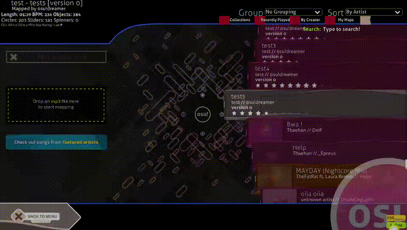

# Osu! Beatmap Generator with Latent Diffusion

Osu! Beatmap is a machine learning system that generates osu!standard (osu!std) beatmaps directly from raw audio. Powered by diffusion-based generative models, Osu! Beatmap takes songs and transforms them into playable rhythm game maps—automatically.

## Demo

- **📹 [Watch a generated beatmap in action](https://drive.google.com/drive/folders/1qbL3JJkcii7D63Ne_oPtwUFyV6pn6Gj6?usp=sharing)**
- Short demo gif 


---

## Project Structure

- `osu_dreamer/model/` — Model training and prediction scripts
- `lightning_logs/` — Logs and model checkpoints
- `model.yml` — Configurable training parameters

---

## Model Training

### Step 1: Generate Dataset
You can generate training data using your local osu! installation:

```bash
$ poetry run python -m osu_dreamer.model generate-data [MAPS_DIR]
```

Where `[MAPS_DIR]` is the path to your osu! Songs directory.

### Step 2: Train the Model

```bash
$ poetry run python -m osu_dreamer.model fit
```

Monitor training with TensorBoard:

```bash
$ tensorboard --logdir=lightning_logs/
```

Resume training from a checkpoint:

```bash
$ poetry run python -m osu_dreamer.model fit --ckpt-path path/to/checkpoint.ckpt
```

---

## Generate Beatmaps Locally

```bash
$ poetry run python -m osu_dreamer.model predict --audio_file song.mp3 --model_path model.ckpt --num_samples 3 --title "Song Title" --artist "Artist Name"
```

Additional options:

- `--sample-steps`: Number of diffusion steps (default is optimal)
- `--num_samples`: How many beatmaps to generate

---

## Development Setup

### Requirements

- Python 3.9  
- Poetry  
- FFmpeg  

### Installation

```bash
git clone https://github.com/jaswon/osu-dreamer
cd osu-dreamer
poetry install
```

## Pretrained Weights and Dataset

- Download the training dataset (8GB)

```bash
curl -L -o 8gb.zip http://jet1.artiom.me:9008/8gb.zip
```

Alternatively, open the link manually in your browser:

```
http://jet1.artiom.me:9008/8gb.zip
```
- [Download pretrained model weights](https://drive.google.com/drive/folders/1hKSQ5Zy6o3Jc0vfC8sJqz94O-cT3LBkn?usp=sharing)

---

## Visual Validation

At the end of each training epoch, Beatgenie produces validation plots:

- Audio spectrogram  
- Ground truth beatmap signal  
- Generated beatmap signals  

These visualizations offer insight into model learning and beat alignment.

---

## Tech Stack

- PyTorch Lightning  
- Diffusion Models  
- FFmpeg  
- Poetry (for dependency management)  
- TensorBoard (for monitoring)  

---

## License

MIT License — open for research and educational use.


